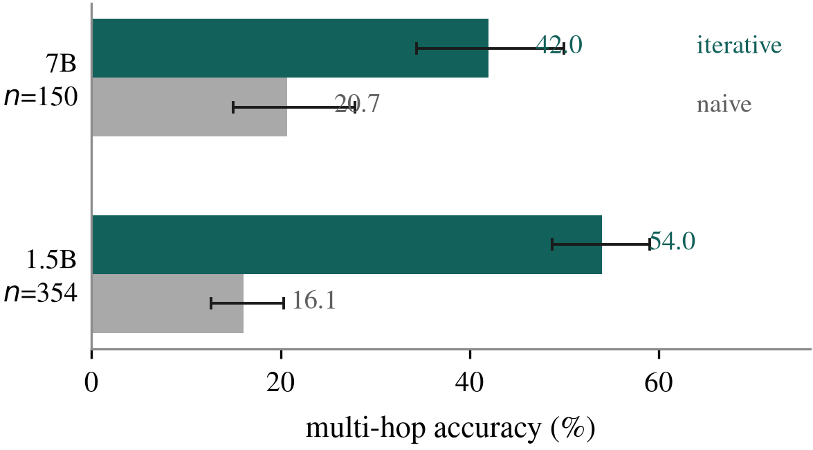
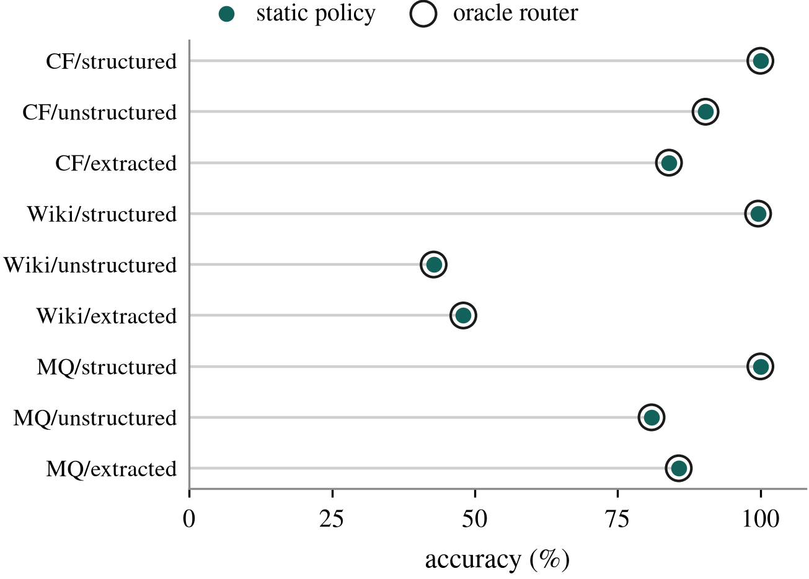
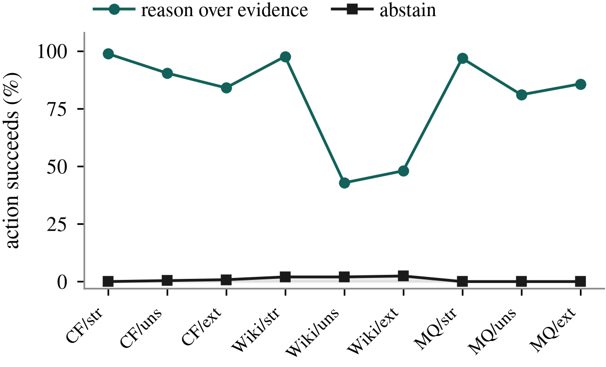

<!-- <CENTERED SECTION FOR GITHUB DISPLAY> -->

<div align="center">


<h1>INLAY</h1>

**Gradient-free knowledge editing. The model is never touched, and an edit is a row you can delete.**

</div>

> [!TIP]
>
> Corrects a fact inside a frozen LLM in about **5 ms with zero gradient steps** — roughly **1600× cheaper** than weight-editing methods — by keeping edits in an external addressable memory and replaying them in logit space at decode time. Deletion is exact. When no edit applies, output is unchanged bit for bit, so locality holds by construction rather than by measurement. <br />
> It also carries a result I did not go looking for: on the field's standard benchmarks, **a one-line static policy is provably optimal**, and the scope machinery this whole family of methods is built around *cannot be measured at all.*
>
> | [](https://github.com/Aditya-PS-05) | Follow [@Aditya-PS-05](https://github.com/Aditya-PS-05) on GitHub for more projects. Working on knowledge editing, on-device inference, and model evaluation tooling. |
> | :-----| :----- |

<div align="center">

[](https://www.python.org/)
[](https://pytorch.org/)
[](https://huggingface.co/docs/transformers)
[](https://github.com/zjunlp/EasyEdit)
[](#results)
[](./paper/paper.pdf)
[](https://github.com/Aditya-PS-05/INLAY/stargazers)
[](https://github.com/Aditya-PS-05/INLAY/issues)
[](./LICENSE)

</div>

<!-- </CENTERED SECTION FOR GITHUB DISPLAY> -->

> **The whole idea in one line: leave the weights alone, and keep the corrections somewhere you can point at.**


> Weight editing rewrites state shared by every fact the model knows. INLAY leaves that state frozen and puts the correction in a table beside it, consulted at decoding time. Every other property in this README follows from that one structural choice.

## Overview

**INLAY** is a knowledge editor for language models. The task: a fact changed in the real world, the model still believes the old one, and retraining costs millions. Fix that one fact without breaking anything else.

The dominant approach — ROME, MEMIT, AlphaEdit — locates the weights most responsible for a fact and solves for a minimal update. The localisation is real science, and the methods work. But every edit permanently mutates weights shared with everything else, and the damage compounds as edits accumulate.

INLAY takes the other side of that trade. The model is frozen and never modified. Each edit is a row in an external table: a key (an embedding of the fact's question form), the answer's token sequence, and metadata. At decoding time a gate decides whether a stored edit applies, and if it does, the intended token's score is nudged just before the model commits to it.

Three properties fall straight out of that:

- **Writing is insertion**, not optimisation. ~5 ms, no gradients, no covariance statistics to estimate.
- **Deleting is exact.** Remove the row and the edit is genuinely gone. Unlearning a gradient-installed fact is an open research problem — which matters when removal is a regulatory requirement rather than a nicety.
- **Locality is structural.** When the gate does not fire, output is identical bit for bit. Not "high locality score" — unchanged.

The cost is equally structural, and I would rather state it up here than bury it: **INLAY recites facts, it does not reason with them.** That is the honest boundary of the approach, and [Limitations](#limitations-honest) says where it bites.

### Why "INLAY"?

An inlay in woodworking is a contrasting material set into a recess so it sits flush with the surface — decorating the wood without weakening it. That is exactly the architecture: new knowledge set into a frozen substrate, flush, load-bearing, removable without damage.

The method was called **CAKE** ("Chunk-Addressable Knowledge Editing") until August 2026, when a search against published work found that namespace contested. Commits and result files dated before the rename use the old name; they are the same method. The remote GPU paths (`~/kw/cake_prototype`, `~/cake/EasyEdit`) still carry the old name on disk and are intentionally left alone so syncing keeps working.

## Contents

- [Overview](#overview)
  - [Why "INLAY"?](#why-inlay)
- [Results](#results)
  - [Edit accuracy](#edit-accuracy)
  - [Write cost](#write-cost)
  - [Multi-hop](#multi-hop)
- [The Negative Result](#the-negative-result)
- [How It Works](#how-it-works)
- [Installation](#installation)
- [Usage](#usage)
- [Repository Layout](#repository-layout)
- [Methodology](#methodology)
- [Limitations (honest)](#limitations-honest)
- [Paper](#paper)
- [Acknowledgments](#acknowledgments)
- [License](#license)

## Results

All numbers come from logged runs in this repository. Splits are subject-disjoint with seed 0, and scoring uses one convention everywhere — a diacritic- and case-insensitive substring match against gold and its aliases — rather than each method's internal metric, so the comparison is like-for-like.

### Edit accuracy


CounterFact, structured input, GPT-J-6B, n=147. Two of those results are failures of methods that work fine elsewhere, and both are worth reading:

- **WISE reaches 66.67% despite its edits landing.** EasyEdit's own post-edit metric reports success on 141 of 147 edits, yet generation-time accuracy sits far below ROME's. WISE routes through a side-memory module at generation time, and that routing is an extra point of failure that in-place updates do not have. The edit registers; it is not reliably retrieved.
- **GRACE does not land at all**, reading exactly 0.0 on every edit and correctly tripping a fail-loud guard rather than reporting a misleading number. An independent generation-based harness agreed: its radius-based codebook matching almost never fires on paraphrases.

### Write cost

INLAY writes in **5–15 ms with no gradient step**, against seconds for gradient-based editors — roughly **1600× cheaper**. This is the systems argument, and it is not marginal: inserting a row is not a cheaper optimisation, it is the absence of one. (The mechanism producing that number is panel (b) of the architecture figure above — the intervention is one bias term added at the final decoding step, not a search or an update rule.)

### Multi-hop



The first iterative multi-hop loop scored **5.0%** against a naive baseline's 22.5% — more than four times *worse* than doing nothing clever. Every sampled failure produced no answer at all, which pointed at termination rather than accuracy.

The cause was a wrong assumption. MQuAKE-CF chains mix edited facts with ordinary unedited world facts (277 of 354 groups have exactly one edit across a 2–3 hop chain). The loop treated every hop as something that must be retrieved and verified against the edit index, so a hop needing a never-edited fact terminated the chain answerless.

Treating a retrieval miss as "answer this hop from base knowledge and **continue**" took it from 5.0% to 47.5% on the same sample, and it holds at scale: **53.95% vs 16.10%** on the full 354-group pool, and **42.00% vs 20.67%** at 7B.

## The Negative Result

> **Why this section exists:** it is the most useful thing in this repository, and it revises a claim I had already measured and believed.

Retrieval-based editors of this family all include a **scope decision**: given a query, does a stored edit apply, and what should be done about it? I built increasingly careful machinery for that decision, measured statistically significant gains from it, and then found the gains were not what they appeared.



For 1,689 queries spanning all three datasets and all three input conditions, I executed **every candidate action** and scored the result, giving per-query ground truth for which actions actually work.

**An oracle router that picks the best available action on every query is exactly equal to a one-line static policy** — "recite directly where that is legal, otherwise reason over the retrieved evidence." Identical to four decimal places in all nine cells. The maximum possible gain of any per-query routing method, learned or otherwise, over one line of code is **0.00 points**.



The mechanism is stark. Abstention succeeded on 19 of 1,689 queries, and on all 19, reasoning or direct recitation succeeded too. **Abstention is the sole winning action zero times.**

The reason is structural and, once seen, obvious. These are **counterfactual** benchmarks. The evaluation question asks for the *post-edit* answer, so answering from parametric knowledge returns the *pre-edit* value — wrong by construction. Abstention cannot be correct on a benchmark where every question targets an edited fact.

**What that does to the machinery I built.** A reliability head that predicts retrieval trustworthiness from the *shape* of the candidate set — margins, entropy, how many candidates clear threshold — rather than the magnitude of its top score reached 0.956 AUROC on a held-out dataset it had never seen, and produced real gains: +15.9 points on two MQuAKE-CF cells (p=0.0019, Holm-corrected). Those numbers are correctly measured and I stand behind them. **The explanation was wrong.** It does not adapt per query, because there is no per-query decision worth making — it suppresses gates that misfire, converging toward the static policy. Its gains measure the harm the fixed gates were doing, not insight it adds.

**And the part that generalises past this repository:** scope classification is load-bearing for the SERAC-descendant design family, whose entire premise is a learned decision about whether a stored edit applies. On these benchmarks that decision is degenerate. **A benchmark with no negatives cannot measure a classifier's ability to reject**, and any abstention path evaluated on one can only lose points.

The missing condition is constructible — ask evaluation questions against an index that does *not* contain the corresponding edit — and that is the next experiment.

## How It Works

```
   query
     │
     ▼
┌──────────────┐   embed with a small sentence encoder (MiniLM),
│  addressing  │   compress with a random JL projection,
└──────┬───────┘   retrieve the nearest key
       │
       ▼
┌──────────────┐   absolute similarity threshold
│     gate     │   + margin over the runner-up
└──────┬───────┘   + relation-residual check
       │
       ├──── no fire ──────►  frozen model runs untouched
       │                      (output identical bit for bit)
       ▼
┌──────────────┐   at each decoding step, add a boost along the
│   playback   │   intended token's unembedding direction so it
└──────┬───────┘   wins the argmax; positions outside the answer
       │           span are never touched
       ▼
    answer
```

The random projection is deliberate rather than lazy. A *learned* projection would need data, would drift as the edit distribution changed, and would silently invalidate every key already stored. A fixed random matrix never invalidates the memory, at the cost of a few points of distortion. For an append-only store meant to be long-lived, that is the right side of the trade.

Intervening in **logit space** rather than hidden state is a safety argument, not a convenience. A logit boost affects exactly one token's score. A hidden-state edit propagates through the unembedding to *every* token's logit in ways that are hard to bound.

## Installation

```bash
git clone https://github.com/Aditya-PS-05/INLAY
cd INLAY

python -m venv .venv && source .venv/bin/activate
pip install torch transformers sentence-transformers numpy scikit-learn
```

GPT-2 downloads on first run. The GPT-J / Qwen / Mistral experiments want a GPU with ≥24 GB; the weight-editing baselines additionally need [EasyEdit](https://github.com/zjunlp/EasyEdit) and its hyperparameter files.

## Usage

```bash
# the core prototype, end to end on GPT-2
python src/run_demo.py --model gpt2 --layer 6 --alpha 10 --topk 1

# full non-oracle pipeline on an AKEW dataset/mode
python src/akew_fullpipeline_eval.py CounterFact unstructured 200

# weight-editing baselines (run from an EasyEdit checkout)
python src/akew_eval_weightedit.py ROME gpt-j-6b 150 gpt-j-6B

# per-action ground truth, then the headroom table
python src/akew_outcome_labels.py CounterFact structured 250
python src/akew_headroom.py "outputs/outcome_labels_*.json"

# rebuild every figure and the paper
python paper/make_figures.py
cd paper && xelatex paper.tex && bibtex paper && xelatex paper.tex && xelatex paper.tex
```

Self-tests, no GPU required:

```bash
python src/akew_stats_test.py        # Wilson, exact McNemar, paired bootstrap, Holm
python src/akew_reliability_test.py  # feature extraction, save/load, ordering guard
```

## Repository Layout

| Path | What lives there |
|------|------------------|
| `src/pk_memory.py` | product-key memory table (write / read / clear, O(√N) addressing) |
| `src/gpt2_memory*.py` | GPT-2 wrapper: layer-L read hook, `lm_head` inject hook, gating, playback |
| `src/akew_*.py` | the AKEW pipeline — data, retrieval, verifier, router, answering, multi-hop |
| `src/akew_eval_weightedit.py` | ROME / MEMIT / AlphaEdit / WISE / GRACE via EasyEdit |
| `src/akew_outcome_labels.py` | executes every candidate action to get per-query ground truth |
| `src/akew_headroom.py` | the oracle-versus-static analysis |
| `src/akew_stats.py` | Wilson intervals, exact McNemar, paired bootstrap, Holm correction |
| `outputs/*.md` | every experiment write-up, including the ones that went badly |
| `paper/` | `paper.md`, `paper.pdf`, and the figure generator |
| `sync_hosts.sh` | syncs sources to GPU hosts and **verifies the symbols landed** |

## Methodology

A few commitments that cost me results and are worth stating:

- **Subject-disjoint splits.** A subject never appears on both sides of a train/test boundary, so a learned component cannot memorise an entity and appear to generalise.
- **One scoring convention everywhere**, not each method's internal metric.
- **The held-out dataset stays held out.** MQuAKE-CF is never touched while training any learned component, so the OOD number is genuinely out-of-distribution.
- **Paired statistics for paired comparisons.** All conditions are scored on identical queries in one pass, so exact McNemar and a paired bootstrap are the correct tests. Holm correction across cells, because testing nine uncorrected buys a spurious result by luck.
- **Fail loud.** A baseline whose edits never land exits non-zero rather than reporting a plausible number.

One implementation note that materially affects correctness: `BaseEditor.edit(sequential_edit=False)` in EasyEdit restores weights before returning, so generating after it returns silently scores the *unedited* model. Every baseline here uses `sequential_edit=True` with an explicit state-dict snapshot and restore under harness control.

## Limitations (honest)

- **Recitation, not reasoning.** Logit-space playback reproduces a stored answer; it cannot combine that answer with anything else, because by the final decoding step there is no reasoning left to influence. Structural, not a tuning problem.
- **Scope precision on hard negatives is the real open problem.** On RippleEdits — which *does* contain same-subject/different-relation queries, and therefore partial negatives — INLAY's preservation score was the worst in the comparison at 0.05, from keys over-firing. [The Negative Result](#the-negative-result) explains why the main benchmarks never forced me to confront this.
- **Small cells.** MQuAKE-CF slices are n=63. A +6.4-point structured-mode result rests on four discordant pairs, where the smallest attainable exact McNemar p is 0.125 — suggestive, not established.
- **One retrieval stack.** A single encoder and one cross-encoder verifier throughout; sensitivity to those choices is untested.
- **Multi-token answers.** The value path stores a token sequence, so playback must reproduce it exactly; a tokenizer boundary that shifts in a new sentence context can derail playback mid-answer.
- **A scale anomaly diagnosed but not fixed.** WikiUpdate is 4.38 points *worse* at 7B than at 1.5B. Not an editing failure: the larger model refuses to answer far more often on noisy evidence (46.88% vs 29.38%), and substring accuracy scores a refusal identically to a wrong answer. It is more accurate whenever it *commits* — it simply commits less.

## Paper

The full write-up is [`paper/paper.pdf`](./paper/paper.pdf) — 6 pages, two-column, source in [`paper/paper.tex`](./paper/paper.tex) with references in [`paper/refs.bib`](./paper/refs.bib). It covers the method, the five-way baseline comparison, the multi-hop fix, the routing investigation *and its refutation*, and what the benchmark finding means for the field.

## Acknowledgments

- [Meng et al.](https://arxiv.org/abs/2202.05262) for ROME and causal tracing — still the clearest account of where factual recall lives in a transformer, and the work this project defines itself against.
- [MEMIT](https://arxiv.org/abs/2210.07229) and AlphaEdit for the mass-editing and null-space-constrained lines.
- [EasyEdit](https://github.com/zjunlp/EasyEdit) for making a fair five-way baseline comparison tractable at all.
- **SERAC** for the scope-classifier idea and **IKE** for the demonstration mechanism. Both are built on directly here, and neither is claimed as novel.
- [AKEW](https://github.com/xiaoze-nlp/AKEW) for the unstructured and extracted input conditions that made the structural limits of weight editing visible.
- [Hase et al.](https://arxiv.org/abs/2301.04213), *Does Localization Inform Editing?* — for the uncomfortable finding that causal-tracing localisation is a poor predictor of where an edit should go. It is a large part of why this project stopped trying to find the right layer.
- [TryAudex](https://github.com/Aditya-PS-05/tryaudex) and [Codesm](https://github.com/Aditya-PS-05/codesm) for the README layout this project copied wholesale.

## License

<p align="center">
  <strong>MIT, by <a href="https://github.com/Aditya-PS-05">Aditya Pratap Singh</a></strong>
</p>

If you find this useful, **please consider starring it** or [follow me on GitHub](https://github.com/Aditya-PS-05). Issues and PRs welcome — particularly on the out-of-scope evaluation condition described in [The Negative Result](#the-negative-result), which is the experiment this work most needs next.
