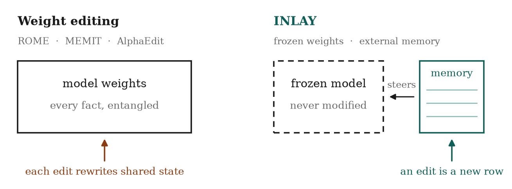
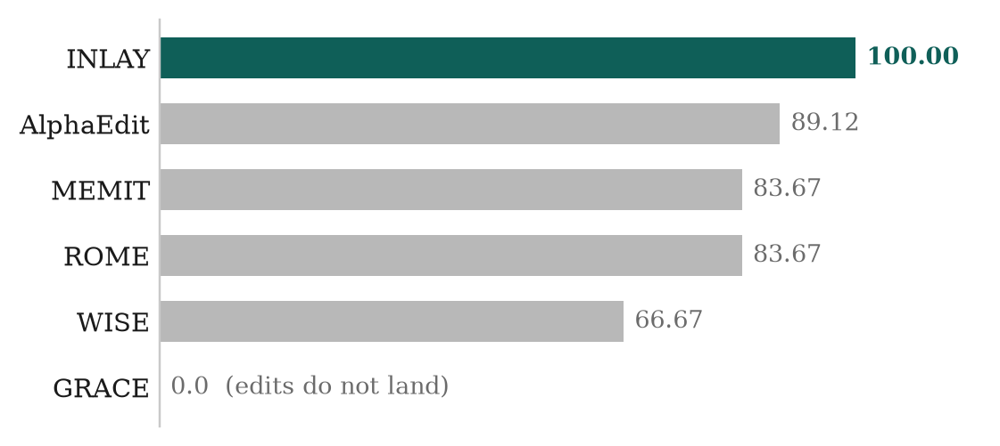
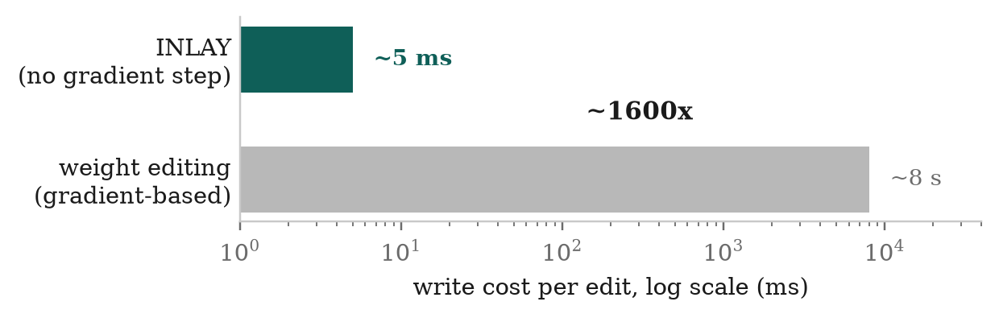
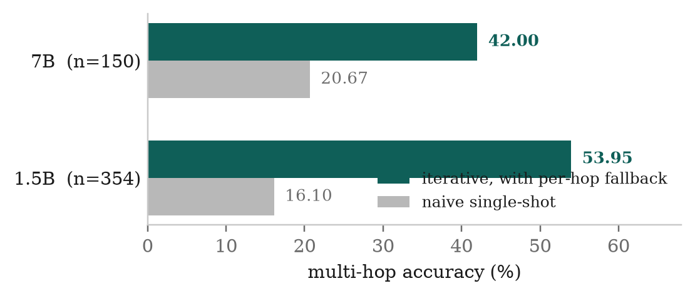
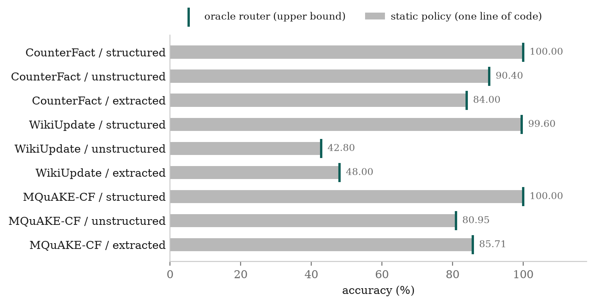

## Abstract

Deployed language models go stale the moment training ends, and retraining
them costs millions. Knowledge editing asks whether a single fact can be
corrected surgically instead. The dominant approach locates the weights
responsible for a fact and rewrites them, which works but permanently mutates
state shared with everything else the model knows.

I take the opposite position. INLAY leaves the model completely frozen and
stores corrections in an external addressable memory, replaying them at
decoding time by nudging the score of the intended token just before the model
commits to it. Writing an edit is inserting a row: roughly five milliseconds
with no gradient step, about 1600 times cheaper than gradient-based editors.
Deleting an edit is exact. When no correction applies, the model's output is
unchanged bit for bit, so locality holds by construction rather than by
measurement.

On CounterFact and zsRE across four model families, INLAY leads ROME, MEMIT,
WISE, GRACE and AlphaEdit on edit accuracy. I extend it to AKEW, which supplies
unstructured and LLM-extracted evidence in addition to clean triples — input
conditions for which weight-editing methods have no mechanism at all.

The second half of this paper reports a negative result I did not go looking
for. Retrieval-based editors of this family all include a scope decision:
given a query, does a stored edit apply? I built increasingly careful machinery
for that decision, measured real gains from it, and then discovered the gains
were not what they appeared. By executing every candidate action on 1,689
queries and recording which ones actually produced correct answers, I found
that a one-line static policy is **provably optimal** on this entire benchmark
suite: an oracle router that always picks the best available action ties it
exactly, in all nine dataset-by-mode cells. The reason is structural. These are
counterfactual benchmarks, so answering from the model's own knowledge returns
the pre-edit value and is wrong by construction. Abstention can never be
correct when every question targets an edited fact.

That has a consequence beyond my own system. Scope classification is
load-bearing for an entire family of architectures, and the field's standard
benchmarks cannot reward it.

---

## 1. Introduction

A model's knowledge is not stored anywhere you can point to. There is no row in
a table reading "the CEO of X is Y." That fact exists only as a pattern
distributed across billions of weights, each of which also participates in
thousands of unrelated facts. This is why editing is hard, and it is the
premise every method in the area has to deal with.

The dominant family — ROME, MEMIT, AlphaEdit — deals with it by locating the
weights most responsible for a fact and solving for a minimal update. The
localisation is real science: causal tracing corrupts the subject tokens, then
restores internal activations one site at a time to find which sites recover the
answer, and recovery concentrates in mid-layer MLPs at the final subject token.
But every edit made this way permanently mutates weights shared with everything
else, and the damage compounds under repeated editing.

I wanted to know what happens if you refuse to touch the weights at all.

### 1.1 Contributions

1. **INLAY**, a gradient-free editor: frozen model, external addressable
   memory, logit-space playback. Roughly 5 ms per write against seconds for
   gradient-based editors, with exact deletion and locality by construction
   (§2, §4).
2. **Extension to non-structured evidence.** Weight editors require a clean
   `(prompt, target)` pair and have no mechanism for raw evidence prose. I
   evaluate across all three AKEW input conditions (§5).
3. **A multi-hop fix and its validation.** Diagnosing why per-hop retrieval
   failure was terminating chains, and a fallback that more than triples
   accuracy, holding at two model scales (§6).
4. **A negative result about routing, and about the benchmarks.** On 1,689
   queries with per-action ground truth, an oracle router ties a one-line
   static policy exactly. Abstention is never uniquely correct — not once.
   Current benchmarks structurally cannot measure the scope decision that this
   architecture family depends on (§7, §8).

---

## 2. Method



### 2.1 The bet

Keep the model frozen. Put edits in an explicit external table. Each entry
holds a key (an embedding of the fact's question form), the answer's token
sequence, and metadata such as the relation.

Three properties fall straight out of that choice:

- **Writing is insertion.** No gradients, no optimisation, no covariance
  statistics to estimate. Measured at 5–15 ms.
- **Deleting is exact.** Remove the row and the edit is genuinely gone.
  Unlearning a gradient-installed fact is, by contrast, an open research
  problem — which matters when removal is a regulatory requirement rather
  than a nicety.
- **Edits cannot interfere.** They are physically separate state, so they
  cannot collide with each other or with the base model.

### 2.2 Addressing

Keys come from a small sentence encoder (MiniLM), chosen deliberately rather
than reusing the base model's hidden states: it is fast, its similarity
geometry is purpose-trained for paraphrase matching, and it stays fixed if the
base model is swapped, so one memory can in principle serve several frozen
models. Keys are compressed with a Johnson–Lindenstrauss random projection.

The projection being *random* rather than learned is a deliberate trade. A
learned projection would need data, would drift as the edit distribution
changed, and would silently invalidate every key already stored. A fixed random
matrix never invalidates the memory, at the cost of a few points of distortion
against an optimal learned map. For an append-only store meant to be long-lived,
that is the right side of the trade.

### 2.3 Playback

Retrieval always returns *something* — the nearest key. A gate decides whether
that nearest match is a real hit, stacking an absolute similarity threshold, a
margin check against the runner-up, and a relation-residual check that asks
whether the query is about the stored *relation* rather than merely the stored
subject.

Once the gate approves, INLAY must make a frozen model say the stored answer.
At each decoding step the model produces a score for every vocabulary token and
takes the argmax. INLAY adds a boost along the intended token's unembedding
direction so that token wins, walking the stored answer one token at a time and
leaving every position outside the answer span untouched.

Intervening here rather than in hidden state is a safety argument, not a
convenience. A logit boost affects exactly one token's score. A hidden-state
edit propagates through the unembedding to *every* token's logit in ways that
are hard to bound. And because the intervention is gated, when the gate does
not fire the model's behaviour is unchanged bit for bit — locality is
structural, not empirical.

---

## 3. Experimental setup

Base models: GPT-J-6B, Qwen2.5-7B, Qwen2.5-1.5B-Instruct, Mistral-7B.
Benchmarks: CounterFact, zsRE, RippleEdits, and AKEW (CounterFact, WikiUpdate,
MQuAKE-CF across structured, unstructured and extracted input conditions).

Two methodological commitments are worth stating because they cost me results.
First, every split is **subject-disjoint**: a subject never appears on both
sides of a train/test boundary, which prevents a learned component from
memorising an entity and appearing to generalise. Second, scoring uses one
convention everywhere — a diacritic- and case-insensitive substring match
against gold and its aliases — rather than each method's internal metric, so
numbers are comparable across methods that report differently.

Baselines run through EasyEdit. One implementation note that materially affects
correctness: `BaseEditor.edit(sequential_edit=False)` restores weights before
returning, so generating after it returns silently scores the *unedited* model.
Every baseline here uses `sequential_edit=True` with an explicit state-dict
snapshot and restore under harness control.

---

## 4. Results: accuracy and write cost



INLAY reaches 100% on this cell. AlphaEdit is the strongest weight editor at
89.12%, consistent with its design: constraining the update to the null space
of preserved knowledge makes each edit more surgical. ROME and MEMIT land at an
identical 83.67% — plausible rather than suspicious, since single-fact
CounterFact is where both converge and MEMIT's real advantage is multi-edit
preservation, not single-edit accuracy.

Two results in that figure deserve their own sentence, because both are
failures of methods that work fine elsewhere.

**WISE reaches only 66.67% despite its edits landing.** EasyEdit's own
post-edit metric reports success on 141 of 147 edits, yet generation-time
accuracy is far below ROME's. WISE routes through a side-memory module at
generation time, and that routing is an additional point of failure that
in-place weight updates do not have. The edit registers; it is not reliably
retrieved.

**GRACE does not land at all.** Its post-edit accuracy reads exactly 0.0 on
every edit, correctly triggering a fail-loud guard rather than reporting a
misleading number. This agrees with an independent generation-based harness I
ran earlier: GRACE's radius-based codebook matching almost never fires on
paraphrases. Two independent harnesses agreeing is why I record this as a real
limitation on this model and dataset rather than a bug I failed to chase down.



The write-cost gap is the systems argument, and it is not marginal. Inserting a
row is not a cheaper optimisation — it is the absence of one.

---

## 5. Non-structured evidence

Weight-editing methods need a `(prompt, target)` pair to compute their update
from. They have no mechanism for "here is a paragraph of evidence, extract and
install whatever matters." Building that extraction step is a separate research
problem, so on AKEW's unstructured and extracted conditions the weight-editing
family is not merely worse — it is inapplicable. I state this as a structural
limitation rather than working around it.

INLAY's retrieval-based design handles all three conditions. Accuracy is lower
on extracted input (78.23% on CounterFact) than on unstructured prose (87.07%),
which traces to extraction noise rather than retrieval failure: retrieval finds
the right card 98.64% of the time either way. An LLM-extracted triple is a
lossier summary than the prose it came from.

While running this I found a real bug in my own router. It was selecting the
recite-directly path for all 147 unstructured queries, even though that path
degrades to reciting a raw evidence sentence outside structured mode. Gating
the decision on input mode recovered the gap: unstructured moved from 85.71% to
87.07%, and structured stayed at 100%. It was invisible to every oracle-evidence
experiment I had run, because those never exercised the live routing decision.

---

## 6. Multi-hop



My first iterative multi-hop loop scored 5.0% against a naive single-shot
baseline's 22.5% — more than four times *worse* than doing nothing clever.
Every sampled failure produced no answer at all, which pointed at termination
rather than accuracy.

The cause was a wrong assumption. MQuAKE-CF's chains mix edited facts with
ordinary unedited world facts: 277 of 354 groups contain exactly one edit
across a two- or three-hop chain. My loop treated every hop as something that
must be retrieved and verified against the edit index, so when a hop needed a
fact that was never edited — and therefore was not in the index — retrieval
correctly found nothing, and the chain terminated answerless.

The fix is to treat a retrieval miss as a signal to fall back to the model's own
knowledge for that hop and **continue**, rather than as chain failure. That took
the loop from 5.0% to 47.5% on the same sample, and it holds at scale: 53.95%
against 16.10% on the full 354-group pool, and 42.00% against 20.67% at 7B.

One failure pattern recurred identically across all three runs: two genuinely
different questions, both routing through a "founder of a religion" hop,
converging on the same wrong answer. Three independent runs reproducing the same
specific error is evidence of a real confusion rather than noise.

---

## 7. The routing investigation, and where it ended

Everything above rests on a scope decision: given a query, does a stored edit
apply, and what should be done about it? I spent the largest single block of
this project on that decision, and the result is not what I expected.

### 7.1 The failure that started it

On MQuAKE-CF, gating was *net-negative in every input mode*: the routed
pipeline underperformed simply disabling the gates and always reasoning, by up
to 15.87 points. Two natural fixes failed, and their failure was diagnostic.
Recalibrating the verifier threshold moved the false-fire rate from 18.33% to
18.22% — no meaningful change, because the score distributions genuinely
overlap. Raising the confidence threshold from 0.85 to 0.97 changed *nothing*:
byte-identical decisions, because confidence on the *wrong* retrievals was
already above 0.97.

The router was asking how confident the verifier was, when what it needed to
know was whether that confidence was *discriminative*. A verifier scoring 0.99
on the top candidate and 0.98 on four unrelated ones is not confident; it is
saturated. No threshold on a top-1 score can see that.

### 7.2 A second-order signal, which worked

So I built a head that predicts retrieval reliability from the *shape* of the
candidate set rather than the magnitude of its top score: margins to the next
best candidate, how many candidates clear the threshold, entropy over the
neighbourhood, subject diversity among the top-k. Trained on CounterFact and
WikiUpdate with MQuAKE-CF held out entirely, it reached **0.956 AUROC on the
held-out dataset it had never seen**.

The mechanism showed up in the fitted weights rather than being asserted:
71.5% of coefficient mass sat on margin features, and the single largest weight
was −1.43 on the best *competing* candidate's score. The more confident the
verifier is about a rival card, the less trustworthy its top pick. That is
exactly the quantity a first-order threshold cannot express.

Used to gate the router adaptively, it produced real, statistically significant
gains: **+15.9 points on two MQuAKE-CF cells (p = 0.0019, Holm-corrected)**,
while making byte-identical decisions — zero discordant pairs — on the cells
where fixed gating already worked. The gain was identical at 1.5B and 7B.

I thought this was the contribution.

### 7.3 The result that reframed it



Two follow-up experiments failed in ways that pointed the same direction. A
three-way policy using the *magnitude* of predicted unreliability failed on the
cell it was designed to fix and was catastrophic on MQuAKE-CF. Adding the head
to the multi-hop per-hop gate changed nothing at all.

So I stopped improving the router and measured the ceiling instead. For 1,689
queries spanning all three datasets and all three input conditions, I executed
*every* candidate action and scored the result, giving per-query ground truth
for which actions actually work.

**An oracle router that picks the best available action on every query is
exactly equal to a one-line static policy** — "recite directly where that is
legal, otherwise reason over the retrieved evidence." Identical to four decimal
places in all nine cells. The maximum possible gain of any per-query routing
method, learned or otherwise, over one line of code is **0.00 points**.

The mechanism is stark. Abstention succeeded on 19 of 1,689 queries, and on all
19 of those, reasoning or direct recitation succeeded too. **Abstention is the
sole winning action zero times.**

### 7.4 What that does to §7.2

The measured gains in §7.2 are real and I stand behind the numbers. The
*explanation* was wrong. I framed the head as adapting its decision per query
to the local regime. It does not, because there is no per-query decision worth
making. What it actually does is suppress gates that misfire — that is, it
converges toward the static policy. Its gains measure the harm the fixed gates
were doing, not insight it contributes.

A one-line rule matches it everywhere, with no training data, no
out-of-distribution generalisation argument, and none of the fivefold
cross-encoder cost. I would rather report that than let a well-measured number
carry a wrong story.

---

## 8. Why abstention cannot be measured here

The reason is structural and, once seen, obvious.

These are **counterfactual** benchmarks. The evaluation question asks for the
*post-edit* answer. Answering from parametric knowledge alone returns the
*pre-edit* value — which is, by construction, wrong. There is no query in the
suite for which "no edit applies, answer from what you already know" is the
correct behaviour.

Abstention cannot be correct on a benchmark where every question targets an
edited fact.

This generalises past my system. Scope classification is load-bearing for the
SERAC-descendant design family: the entire premise is a learned decision about
whether a stored edit applies. But on these benchmarks that decision is
degenerate — the answer is always "yes." **A benchmark with no negatives cannot
measure a classifier's ability to reject**, and any abstention path evaluated on
one can only ever lose points.

It also explains something about my own system that had been sitting
unexplained. On RippleEdits, which *does* contain same-subject
different-relation queries and therefore has partial negatives, INLAY's
preservation score was the worst in the comparison at 0.05 — keys over-firing
on queries about the right subject but the wrong relation. Scope precision
matters exactly where a benchmark has negatives, and that is precisely where
INLAY is weakest and where the main benchmarks are silent.

The missing evaluation condition is constructible: ask evaluation questions
against an index that does *not* contain the corresponding edit. On such queries
abstention becomes correct, the oracle should pull away from the static policy,
and routing acquires real headroom for the first time. That is the experiment I
would run next, and it measures what every scope-classifier paper claims to
measure.

---

## 9. Limitations

**Recitation, not reasoning.** Logit-space playback reproduces a stored answer.
It cannot combine that answer with anything else, because by the final decoding
step there is no reasoning left to influence. This is structural, and it is why
compositional queries need the retrieve-into-context path rather than playback.

**Scope precision on hard negatives.** The 0.05 RippleEdits preservation score
is the real open problem, and §8 explains why the field's main benchmarks did
not force me to confront it earlier.

**Small cells.** The MQuAKE-CF slices are n=63. The +6.4-point structured-mode
result rests on four discordant pairs, where the smallest attainable exact
McNemar p-value is 0.125 — suggestive, not established, and reported that way.

**One retrieval stack.** A single encoder and one cross-encoder verifier
throughout; sensitivity to those choices is untested.

**A scale anomaly I diagnosed but did not fix.** WikiUpdate is 4.38 points
*worse* at 7B than at 1.5B. It is not an editing failure: the larger model
refuses to answer far more often on noisy evidence (46.88% versus 29.38%
overall, 91.11% versus 66.67% where retrieval is wrong), and substring accuracy
scores a refusal identically to a wrong answer. The larger model is more
accurate whenever it *commits* — it simply commits less. This is a property of
the metric, not of any method, and it means scale comparisons on
noisy-retrieval benchmarks will systematically understate larger models.

---

## 10. Conclusion

Keeping the weights frozen and putting edits in an external addressable memory
buys three things that gradient-based editing cannot offer: writes about 1600
times cheaper, exact deletion, and locality that holds by construction. It pays
for them by reciting facts rather than understanding them, which is a real cost
and the honest boundary of the approach.

The part I did not expect to write is §7 and §8. I built a scope mechanism,
measured genuine gains from it, and then found that the benchmarks could not
distinguish those gains from repairing damage that a simpler system would never
have caused. A one-line policy is provably optimal on all 1,689 queries I
tested, because abstention is never the right answer when every question
targets an edited fact.

I think that is the more useful finding. It suggests that reported routing gains
on these benchmarks measure how much harm a gate was doing, and that an entire
architectural family is being evaluated on suites that cannot reward its central
component. The fix is not a better router. It is a benchmark that contains
queries where the right answer is "this edit does not apply."

---

## Reproducibility

All numbers come from logged runs in this project's repository. Splits are
subject-disjoint with seed 0; the held-out dataset is never touched during
training of any learned component.

```
src/akew_outcome_labels.py     per-action ground truth (§7.3)
src/akew_headroom.py           the oracle-versus-static table
src/akew_reliability.py        the second-order head (§7.2)
src/akew_stats.py              Wilson intervals, exact McNemar,
                               paired bootstrap, Holm correction
src/akew_eval_weightedit.py    ROME / MEMIT / AlphaEdit / WISE / GRACE
paper/make_figures.py          every figure in this paper
```

Self-tests accompany the statistical and learned components (55 assertions
across the reliability, outcome-head and statistics modules), including
checks that the paired bootstrap preserves pairing and that a reordered
feature checkpoint refuses to load rather than silently mispredicting.
